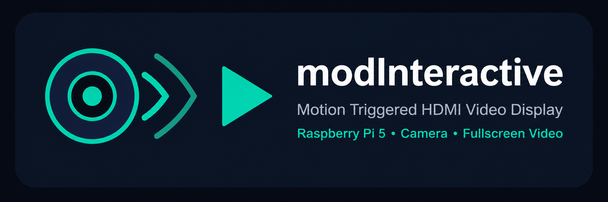

<p align="center">
  
</p>

# modInteractive

Raspberry Pi 5 üzerinde çalışan, kamera hareket algılayınca HDMI ekranda tam ekran video oynatan cafe, mağaza ve vitrin ekran sistemi.

Touchscreen gerekli değildir. HDMI ekran veya TV yeterlidir.

## Amaç

modInteractive, Raspberry Pi 5'e bağlı kamera ile hareket algılar. Hareket algılandığında belirlenen video dosyasını HDMI ekranda tam ekran oynatır. Video bittikten sonra sistem cooldown süresine girer ve ardından tekrar hareket algılamaya devam eder.

Bu sistem cafe, restoran, mağaza, karşılama ekranı, vitrin ekranı ve etkileşimli reklam ekranı senaryoları için tasarlanmıştır.

## Özellikler

- OpenCV ile hareket algılama
- MOG2 background subtraction + frame differencing
- mpv ile tam ekran video oynatma
- Cooldown sistemi
- Kamera reconnect desteği
- Video oynarken yeniden tetiklemeyi engelleme
- Konsol + dosya loglama
- Rotasyonlu log dosyası
- Sistem sağlık kontrolü
- Web admin paneli
- Systemd servisi
- Raspberry Pi 5 uyumlu kurulum
- HDMI ekran / TV desteği
- Touchscreen gerektirmez

## Donanım Gereksinimleri

- Raspberry Pi 5
- 8GB RAM önerilir
- Raspberry Pi Camera Module veya USB webcam
- HDMI ekran veya TV
- 32GB veya daha büyük microSD kart
- Güçlü ve kaliteli Raspberry Pi 5 adaptörü
- İnternet bağlantısı

## Yazılım Gereksinimleri

- Raspberry Pi OS
- Python 3
- OpenCV
- NumPy
- Flask
- mpv
- v4l-utils
- systemd

## Hızlı Kurulum

```bash
git clone https://github.com/WeAreTheArtMakers/modInteractive.git
cd modInteractive
cp /path/to/greeting.mp4 videos/selamlama.mp4
sudo bash install.sh
sudo systemctl start modinteractive
sudo systemctl status modinteractive
```

## Manuel Kurulum

```bash
sudo apt update
sudo apt install -y python3 python3-venv python3-pip python3-opencv python3-numpy mpv v4l-utils

git clone https://github.com/WeAreTheArtMakers/modInteractive.git
cd modInteractive

python3 -m venv --system-site-packages venv
source venv/bin/activate

pip install -r requirements.txt

cp /path/to/greeting.mp4 videos/selamlama.mp4

python main.py --check
python main.py
```

## Systemd Servisi

Kurulum scripti servisi otomatik kurar ve enable eder.

```bash
sudo systemctl start modinteractive
sudo systemctl status modinteractive
journalctl -u modinteractive -f
```

Servisi durdurmak veya yeniden başlatmak için:

```bash
sudo systemctl stop modinteractive
sudo systemctl restart modinteractive
```

## Kullanım

```bash
python main.py
python main.py --check
python main.py --config /path/to/config.json
python main.py --log-level DEBUG
```

## Admin Panel

Admin panel varsayılan olarak port 8080 üzerinden çalışır.

```text
http://raspberrypi.local:8080
```

veya:

```text
http://PI_IP_ADRESI:8080
```

Admin panel ile kamera, hareket algılama, video yolu, ses seviyesi, fullscreen ve cooldown ayarları değiştirilebilir.

Admin panel opsiyoneldir. Panel çalışmasa bile ana kamera ve video sistemi çalışmaya devam eder.

## Config Dosyası

Ana ayarlar `config.json` dosyasındadır.

```json
{
  "system": {
    "log_level": "INFO",
    "project_name": "modInteractive",
    "version": "1.0.0"
  },
  "camera": {
    "index": 0,
    "width": 640,
    "height": 480,
    "fps": 15,
    "backend": "v4l2"
  },
  "detection": {
    "enabled": true,
    "mode": "motion",
    "motion_sensitivity": 500,
    "min_motion_area": 1500,
    "frame_skip": 3,
    "warmup_seconds": 2,
    "cooldown_seconds": 10
  },
  "video": {
    "path": "videos/selamlama.mp4",
    "fullscreen": true,
    "volume": 90,
    "player": "mpv"
  },
  "admin": {
    "enabled": true,
    "host": "0.0.0.0",
    "port": 8080
  }
}
```

## Config Açıklamaları

| Ayar | Varsayılan | Açıklama |
|---|---:|---|
| `system.log_level` | `INFO` | Log seviyesi |
| `camera.index` | `0` | Kamera cihaz indeksi |
| `camera.width` | `640` | Kamera görüntü genişliği |
| `camera.height` | `480` | Kamera görüntü yüksekliği |
| `camera.fps` | `15` | Kamera FPS değeri |
| `camera.backend` | `v4l2` | Linux kamera backend'i |
| `detection.enabled` | `true` | Hareket algılamayı aç/kapat |
| `detection.mode` | `motion` | Algılama modu |
| `detection.motion_sensitivity` | `500` | Hareket piksel eşiği |
| `detection.min_motion_area` | `1500` | Minimum hareket alanı |
| `detection.frame_skip` | `3` | Her kaç frame'de bir analiz yapılacağı |
| `detection.warmup_seconds` | `2` | Kamera/detector ısınma süresi |
| `detection.cooldown_seconds` | `10` | Video sonrası bekleme süresi |
| `video.path` | `videos/selamlama.mp4` | Oynatılacak video dosyası |
| `video.fullscreen` | `true` | Tam ekran oynatma |
| `video.volume` | `90` | Ses seviyesi |
| `video.player` | `mpv` | Video player |
| `admin.enabled` | `true` | Admin panel aç/kapat |
| `admin.host` | `0.0.0.0` | Admin panel host |
| `admin.port` | `8080` | Admin panel port |

## Video Dosyası

Varsayılan video yolu:

```text
videos/selamlama.mp4
```

Kurulumdan önce:

```bash
cp your_video.mp4 videos/selamlama.mp4
```

Kurulumdan sonra:

```bash
sudo cp your_video.mp4 /opt/modInteractive/videos/selamlama.mp4
sudo chown pi:pi /opt/modInteractive/videos/selamlama.mp4
```

Desteklenen video formatları mpv tarafından desteklenen formatlara bağlıdır. Genellikle `.mp4`, `.mov`, `.mkv`, `.avi`, `.webm` kullanılabilir.

## Proje Yapısı

```text
modInteractive/
├── main.py
├── app.py
├── config.json
├── requirements.txt
├── install.sh
├── uninstall.sh
├── README.md
├── assets/
│   └── modinteractive-logo.svg
├── core/
│   ├── __init__.py
│   ├── config.py
│   ├── camera.py
│   ├── detector.py
│   ├── player.py
│   ├── logger.py
│   └── healthcheck.py
├── admin/
│   ├── __init__.py
│   ├── server.py
│   ├── templates/
│   │   └── index.html
│   └── static/
│       ├── style.css
│       └── app.js
├── systemd/
│   └── modinteractive.service
├── videos/
│   ├── README.md
│   └── selamlama.mp4
└── logs/
    └── .gitkeep
```

## Test Komutları

```bash
python3 -m py_compile main.py app.py admin/server.py
python3 -m py_compile core/*.py
bash -n install.sh
bash -n uninstall.sh
python3 main.py --check
```

Systemd dosyasını kontrol etmek için:

```bash
sudo systemd-analyze verify systemd/modinteractive.service
```

Kamera cihazlarını görmek için:

```bash
ls -la /dev/video*
v4l2-ctl --list-devices
```

Videoyu elle test etmek için:

```bash
mpv --fs videos/selamlama.mp4
```

## Sorun Giderme

### Kamera açılmıyor

```bash
ls -la /dev/video*
v4l2-ctl --list-devices
sudo usermod -a -G video pi
sudo reboot
```

USB kamera kullanıyorsan `config.json` içinde başka kamera index'i dene:

```json
{
  "camera": {
    "index": 1
  }
}
```

### Video oynatmıyor

```bash
ls -la /opt/modInteractive/videos/
mpv --version
mpv --fs /opt/modInteractive/videos/selamlama.mp4
```

### Servis başlamıyor

```bash
sudo systemctl status modinteractive
journalctl -u modinteractive -f
sudo -u pi /opt/modInteractive/venv/bin/python /opt/modInteractive/main.py --check
```

### Permission hatası

```bash
sudo chown -R pi:pi /opt/modInteractive
sudo usermod -a -G video,audio,render,input pi
sudo reboot
```

### Admin panel açılmıyor

```bash
journalctl -u modinteractive -f
ss -tulpn | grep 8080
hostname -I
```

Tarayıcıda aç:

```text
http://PI_IP_ADRESI:8080
```

### HDMI ekranda video görünmüyor

```bash
echo $DISPLAY
DISPLAY=:0 mpv --fs /opt/modInteractive/videos/selamlama.mp4
```

Bookworm/Wayland ortamında servis üzerinden görüntü alamazsan uygulamayı desktop autostart veya user-level systemd ile başlatmak gerekebilir.

## Geliştirme

```bash
git clone https://github.com/WeAreTheArtMakers/modInteractive.git
cd modInteractive

python3 -m venv --system-site-packages venv
source venv/bin/activate

pip install -r requirements.txt

python main.py --check
python main.py
```

## Roadmap

- YOLO ile insan algılama
- Çoklu video playlist
- Çalışma saatleri
- Video yükleme ekranı
- Admin panelden servis restart
- İstatistik toplama
- Uzaktan yönetim API'si
- Çoklu ekran desteği

## Lisans

MIT License


## PIR Sensor Mode

This version supports two trigger sources:

- `camera`: camera motion detection
- `pir`: PIR GPIO motion sensor

Run once with PIR:

```bash
python main.py --source pir
```

Or set this in `config.json`:

```json
{
  "trigger": {
    "source": "pir"
  }
}
```

Default PIR input is BCM GPIO 17. See `PIR_SENSOR_NOTES.md`.
